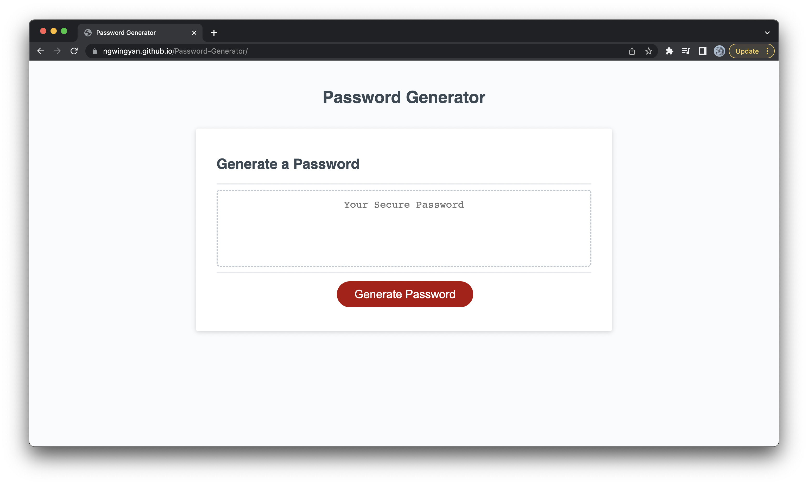
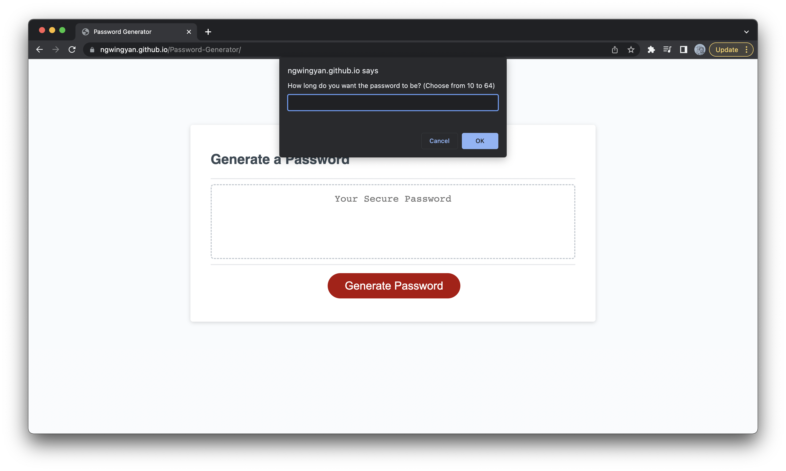
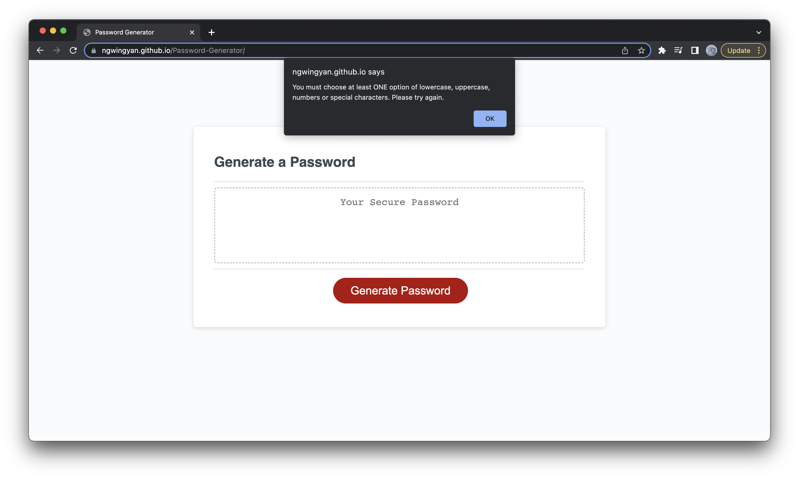

# Password-Generator

## Description

Create an application for users to generate random password based on criteria they can select below -

- Length of password (10 to 64 characters)
- Lowercase or not
- Uppercase or not
- Symbol or not
- Numeric or not

 
## Usage

- Once user press the "Generate Password" button, user is prompted to choose the length of password

- User will be alerted and asked to choose again if input is not valid

- At least one character type should be selected

- When prompts are answered, the password is generated and written on the page

## Technology used
- HTML and CSS and part of javascript were provided in the starter code, purpose is to update the logic in the javascript file and adjust minor referencing due to file structure for the HTML file.

## Link
- Repository URL - https://github.com/ngwingyan/Password-Generator
- Deployed URL - https://ngwingyan.github.io/Password-Generator/

## License
- Please refer to the license in the repository.
